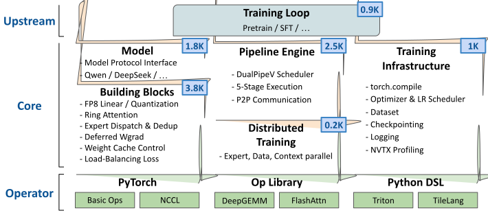

# PithTrain

**Efficient, Python-native MoE training in ~10K lines of code.**

Existing MoE training frameworks force a trade-off: production systems offer full-featured, optimized training but carry 100K+ lines of code with heavy C++/CUDA dependencies; lightweight alternatives are easy to use but lack critical optimizations for MoE models.

PithTrain bridges this gap. It delivers production-grade performance — 4D parallelism, compute-communication overlap, FP8 training — in a codebase small enough to read end-to-end, with zero C++/CUDA build steps.

### Designed for the Age of AI

PithTrain is built to be understood — by humans and AI agents alike. At ~10K lines of Python, the entire codebase fits within the context window of modern AI coding tools. This means AI agents can read, reason about, and evolve the full system, not just isolated files.

## Installation

Hopper (SM90) or Blackwell (SM100) GPUs are required. CUDA 13.0 and Python >= 3.12 are required. We use [uv](https://docs.astral.sh/uv/) to manage project dependencies.

```bash
git clone https://github.com/mlc-ai/PithTrain.git
cd PithTrain
uv venv  # skip if you already have a virtual environment
```

**For users:**

```bash
uv pip install .
```

**For developers:**

```bash
uv sync
```

## Getting Started

Here is an example of pretraining Qwen3-30B-A3B. Other models like DeepSeek-V2-Lite are also supported; see the [`examples`](examples/) directory for more configurations.

**1. Build a tokenized dataset:**

```bash
bash examples/build_tokenized_corpus/launch.sh dclm-qwen3
```

This downloads and tokenizes the dataset to `workspace/datasets/dclm-baseline/toktxt/qwen3`.

**2. Review the training config** at [`examples/pretrain_language_model/qwen3-30b-a3b/script.py`](examples/pretrain_language_model/qwen3-30b-a3b/script.py) and adjust parallelism sizes, batch size, or other hyperparameters to match your cluster.

**3. Launch training:**

```bash
bash examples/pretrain_language_model/launch.sh qwen3-30b-a3b
```

## Architecture

<p align="center">
  
</p>

PithTrain is structured in three layers:

- **Upstream** — Training loop for pretraining, SFT, and more.
- **Core** — The bulk of PithTrain, composed of five modules:
  - *Model* — Protocol interface with implementations for Qwen and DeepSeek architectures.
  - *Building Blocks* — FP8 linear and quantization, ring attention, expert dispatch and deduplication, etc.
  - *Pipeline Engine* — DualPipeV scheduler with 5-stage overlapped forward-backward execution and P2P communication.
  - *Distributed Training* — Expert, data, and context parallelism (PP x EP x FSDP x CP).
  - *Training Infrastructure* — `torch.compile`, optimizer and LR scheduling, checkpointing, logging, etc.
- **Operators** — PyTorch (basic ops, NCCL), operator libraries (DeepGEMM, FlashAttention), and Python DSLs (Triton, TileLang).

## Model Compatibility and Evaluation

Checkpoints can be converted between PyTorch Distributed Checkpoint (DCP) and Hugging Face `safetensors` via [examples/convert_checkpoint](examples/convert_checkpoint/).

The exported checkpoints are Hugging Face-compatible and can be used with evaluation tools like `lm-evaluation-harness` and inference engines like `vLLM` and `SGLang`.

## Attribution

PithTrain is built on top of DeepSeek's [DualPipe](https://github.com/deepseek-ai/DualPipe), which provides the original pipeline parallelism schedule and example code.

## License

PithTrain is released under the [Apache 2.0 License](LICENSE).
